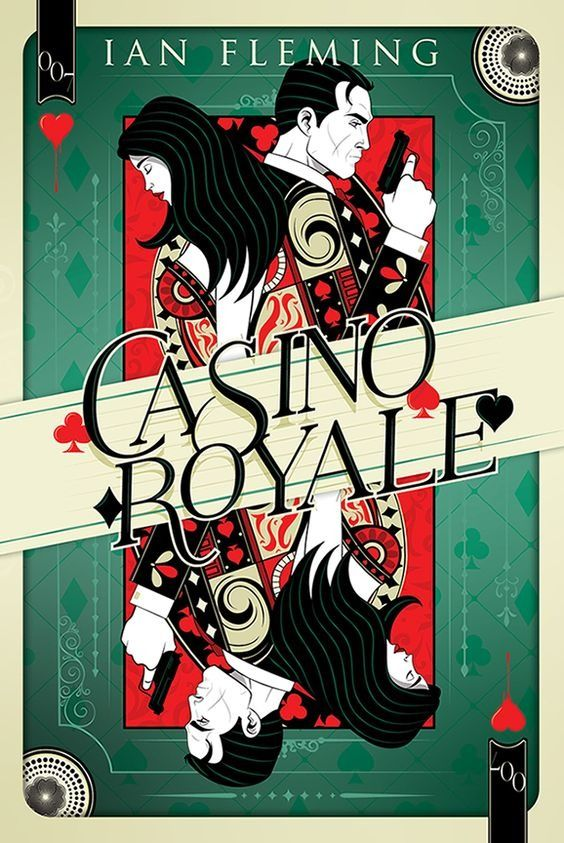
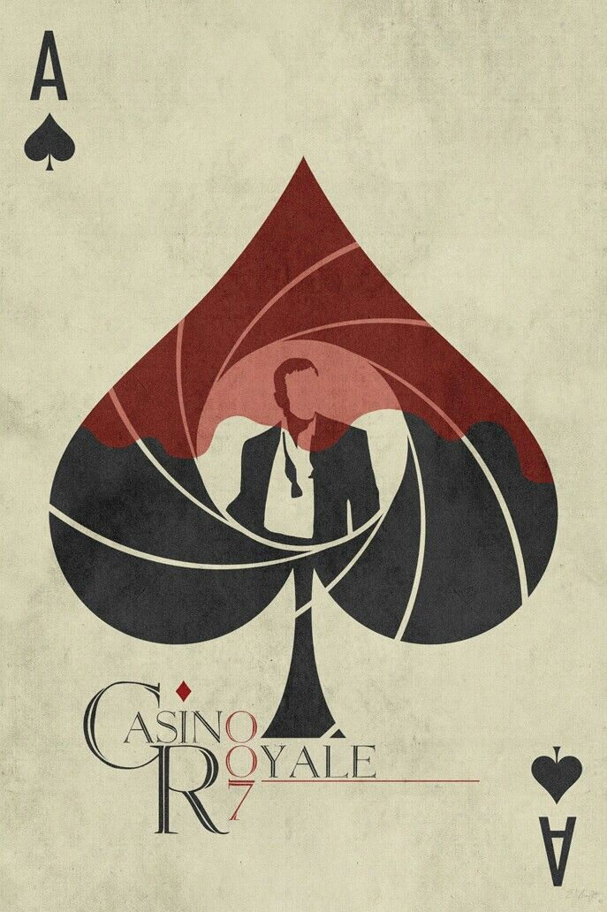
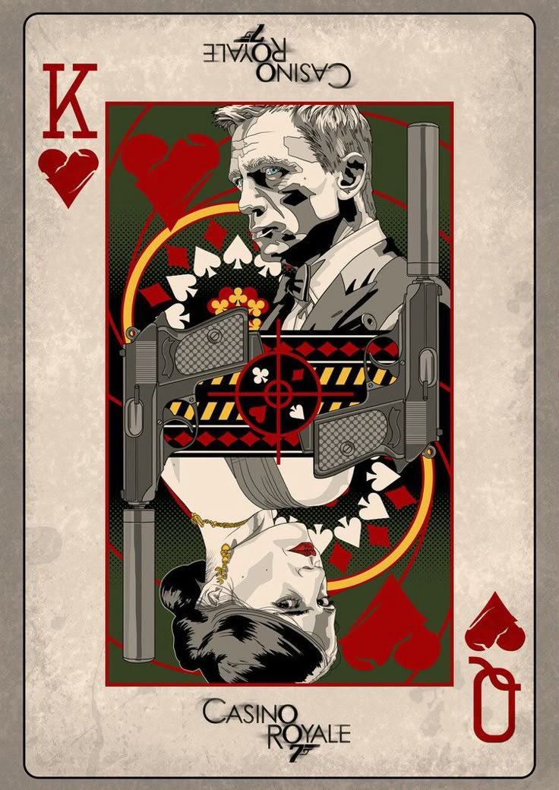

<!-- SECRET AGENT PROFILE: CLASSIFIED -->
<!-- CASINO ROYALE DOSSIER -->

<!-- ====================================================================== -->
<!-- SECTION 1: HERO SECTION & PROFILE INTRODUCTION -->
<!-- ====================================================================== -->

<!-- Hero Image -->

  

  

<!-- Fallback: Static Beautiful Badges if typing animation doesn't work -->

  
  
  

  
### 🤖 **DEVELOPER PROFILE: DEV AGNIHOTRI** 🤖
**Status: Active JedAI Master**  
**Specialty: AI-Powered Full-Stack Development**  
**Focus: Modern Web Technologies & Full-Stack Mastery**  
**Approach: The Force is Strong with This Code**  
**🌟 AI-Driven High-Performance Solutions 🌟**

<!-- Beautiful Flashing Specialties Animation -->

  

<!-- Fallback: Additional Static Specialties if typing animation doesn't work -->

  
    

<!-- ====================================================================== -->
<!-- SECTION 2: AI DEVELOPER LICENSE CARD -->
<!-- ====================================================================== -->

<!-- AI Developer License Card - Landscape Layout -->

## 🤖 **LICENSE TO CODE** 🤖

<table border="1" cellpadding="20" cellspacing="0" style="width: 100%; max-width: 900px; margin: 0 auto;">  <tr>    <!-- Left Side - Photo and Basic Info -->
    <td width="35%" align="center" valign="center" style="padding: 25px;">
        
      
      <h3>DEV AGNIHOTRI</h3>
    </td>
    <!-- Right Side - License Details -->
    <td width="65%" valign="top" style="padding: 25px;">
      <h3 style="margin-top: 0;">📋 DEVELOPER CREDENTIALS</h3>
      <table border="1" cellpadding="8" cellspacing="0" style="width: 100%;">
        <tr>
          <td style="font-weight: bold; width: 35%;">🆔 License ID:</td>
          <td style="font-family: 'Courier New', monospace; font-weight: bold;">AI-007-JEDAI</td>
        </tr>
        <tr>
          <td style="font-weight: bold;">👤 Age:</td>
          <td><strong>Infinite Years</strong></td>
        </tr>
        <tr>
          <td style="font-weight: bold;">🎓 Education:</td>
          <td><strong>High School</strong></td>
        </tr>
        <tr>
          <td style="font-weight: bold;">🤖 Specialty:</td>
          <td><strong>Full-Stack AI Specialist</strong></td>
        </tr>
        <tr>
          <td style="font-weight: bold;">⚡ Level:</td>
          <td><strong>Expert Developer</strong></td>
        </tr>
        <tr>
          <td style="font-weight: bold;">🌍 Base:</td>
          <td><strong>Cal</strong></td>
        </tr>
        <tr>
          <td style="font-weight: bold;">📅 Status:</td>
          <td style="font-weight: bold; color: #008000;">✅ ACTIVE</td>
        </tr>
      </table>
       
    </td>
  </tr>
</table>

<!-- ====================================================================== -->
<!-- SECTION 3: BADGES & SOCIAL LINKS -->
<!-- ====================================================================== -->

<!-- AI JedAI Badges -->

  
  

<!-- Social Network (Secret Communication Channels) -->

  <strong>🔗 SECURE COMMUNICATION CHANNELS 🔗</strong> 
  
  &#8287;&#8287;&#8287;&#8287;&#8287;
  
  &#8287;&#8287;&#8287;&#8287;&#8287;
  
  &#8287;&#8287;&#8287;&#8287;&#8287;
  

 

<!-- Web Technology Stack -->

  <strong>🌐 CORE TECHNOLOGY STACK 🌐</strong> 
  
  
  
  
  
  
  
  
  
  
  

 

<!-- GitHub Stats -->

  
  
  

 

<!-- MI6 Badge -->

  

<!-- ====================================================================== -->
<!-- SECTION 4: INTELLIGENCE ACADEMY & TRAINING DIVISION -->
<!-- ====================================================================== -->

  
<h2>🏛️ Intelligence Academy & Training Division</h2>

### 📋 **Training Notes & Academic Credentials**

_Classified learning materials and specialized training programs from elite academies_

  <!-- Technology Logos Section -->
  

    
    
    
    
  

  <!-- Training Blocks with Associated Links -->
  <table width="100%" cellpadding="20">
    <tr>
      <th width="50%">📚 Secret Agent Training Manuals</th>
      <th width="50%">🎓 Field Operations Academy</th>
    </tr>
    <tr>
      <td align="center" bgcolor="#0f1419" style="padding: 20px; border-radius: 10px; border: 2px solid #FFD700;">
        <h4 style="color: #FFD700;">🔧 JavaScript Intelligence</h4>
        
Advanced JavaScript operations and modern ES6+ techniques for field deployment

        
      </td>
      <td align="center" bgcolor="#0f1419" style="padding: 20px; border-radius: 10px; border: 2px solid #FFD700;">
        <h4 style="color: #FFD700;">☕ Java Combat Training</h4>
        
Enterprise-level Java programming for mission-critical applications

        
      </td>
    </tr>
    <tr>
      <td align="center" bgcolor="#0f1419" style="padding: 20px; border-radius: 10px; border: 2px solid #FFD700;">
        <h4 style="color: #FFD700;">🗄️ Database Operations</h4>
        
Advanced DBMS operations and data intelligence gathering techniques

        
      </td>
      <td align="center" bgcolor="#0f1419" style="padding: 20px; border-radius: 10px; border: 2px solid #FFD700;">
        <h4 style="color: #FFD700;">⚔️ C++ Advanced Tactics</h4>
        
Data structures, algorithms and high-performance computing for tactical operations

        
      </td>
    </tr>
  </table>

  <!-- Support Operations -->
  

      

<!-- ====================================================================== -->
<!-- SECTION 5: ACTIVE MISSION PROJECTS -->
<!-- ====================================================================== -->

 
  
<h2>🎯 Active Mission Projects</h2>
  <!-- Mission Critical Projects -->  

    
    
    
    
    
    
    
  

  

    <strong>🔗 LIVE MISSION DEPLOYMENTS 🔗</strong> 
    
    &#8287;&#8287;
    
    &#8287;&#8287;
    
  

    

<!-- ====================================================================== -->
<!-- SECTION 6: DIGITAL HEADQUARTERS & WEB ASSETS -->
<!-- ====================================================================== -->

 
  
<h2>🌐 Digital Headquarters & Web Assets</h2>
  

    
    
    
  

  

    <strong>🚀 LIVE DIGITAL OPERATIONS 🚀</strong> 
    
    &#8287;&#8287;
    
    &#8287;&#8287;
      

<!-- ====================================================================== -->
<!-- SECTION 7: PROJECTS & ENTERTAINMENT PORTFOLIO -->
<!-- ====================================================================== -->

 
  
<h2>🎮 Projects & Entertainment Portfolio</h2>
  

    
    
    
    
    
    
    
    
    
    
    
  

  
  <!-- Live Entertainment Operations - Horizontal Layout -->
  

    <strong>🎯 LIVE ENTERTAINMENT OPERATIONS 🎯</strong>
  

  
  

    
    
    
    
    
  

  
  

    
    
        
    
    

<!-- ====================================================================== -->
<!-- SECTION 8: OPEN SOURCE & COMMUNITY PROJECTS -->
<!-- ====================================================================== -->

    
<h2>🤝 Open Source & Community Projects</h2>
      

      
      
    

    

      <strong>🌟 COLLABORATIVE DEVELOPMENT PROJECTS 🌟</strong> 
      <em>Building innovative solutions through community collaboration</em>
    

    

<!-- ====================================================================== -->
<!-- SECTION 9: TECHNICAL SKILLS & EXPERTISE -->
<!-- ====================================================================== -->

 
  
<h2>🛠️ Technical Skills & Expertise</h2>

  <!-- Technology Logos Display -->  

    
    
    
    
    
    
    
    
    
  

  <h3>💻 Programming Languages & Markup</h3>
  

      
      
      
      
      
      
      
      
  
  <h3>🎯 Specialized Equipment & Frameworks</h3>
  

      
      
      
      
      
      
      
      
      
      
      
  
<h3>🤖 AI Agents & Intelligence Systems</h3>

  

      
      
      
      
      
      
      
      
  

    <h3>🗄️ Intelligence Databases & Cloud Operations</h3>

  

      
      
      
      
      
      
      
      
      
      
      
      
  

  <h3>🔧 Agent Tools & Equipment</h3>

  
      
      
      
      
      
      
      
        

<!-- ====================================================================== -->
<!-- SECTION 10: CASINO OPERATIONS GALLERY -->
<!-- ====================================================================== -->

<!-- Casino Operations Gallery -->

  <h2>🎰 Casino Royale Operations Gallery 🎰</h2>
  
<em>Intelligence imagery from high-stakes operations</em>

   
  
  
  
  
  
    
  

<!-- 📊 GitHub Statistics & Development Metrics - Always Visible -->

  <h2>📊 GitHub Statistics & Development Metrics</h2>
  
  <h3>🔥 Development Streak</h3>

  

    
  

  <h3>📈 GitHub Performance Metrics</h3>

  

    
    
  

  

    <b>⚠️ CLASSIFIED:</b> Performance metrics reflect only declassified operations and public intelligence.
  

    

    
  

  <!-- Casino Divider -->
  

    
  

---

### 🎰 "The name's Agnihotri. Dev Agnihotri." 🎰

<!-- Agent 007 Portrait -->

<!-- Casino Royale themed footer -->

  🎰  🎰

**🍸 Fast. Precise. Professional.** 🍸  
**🎲 High-performance development. Premium code quality.** 🎲  
**♠️ Straight to the point. No bluff. Just results.** ♠️

---

  

  
---

### 🎯 **FINAL ASSESSMENT** 🎯

**"Do you think you're ready for the high-stakes world of professional development?"**

**🍸 Yes, considerably. 🍸**

---

<!-- END OF CLASSIFIED DOCUMENT -->
<!-- SECURITY LEVEL: TOP SECRET -->
<!-- AGENT: 007 - DEV AGNIHOTRI -->
<!-- MISSION STATUS: ACTIVE -->
